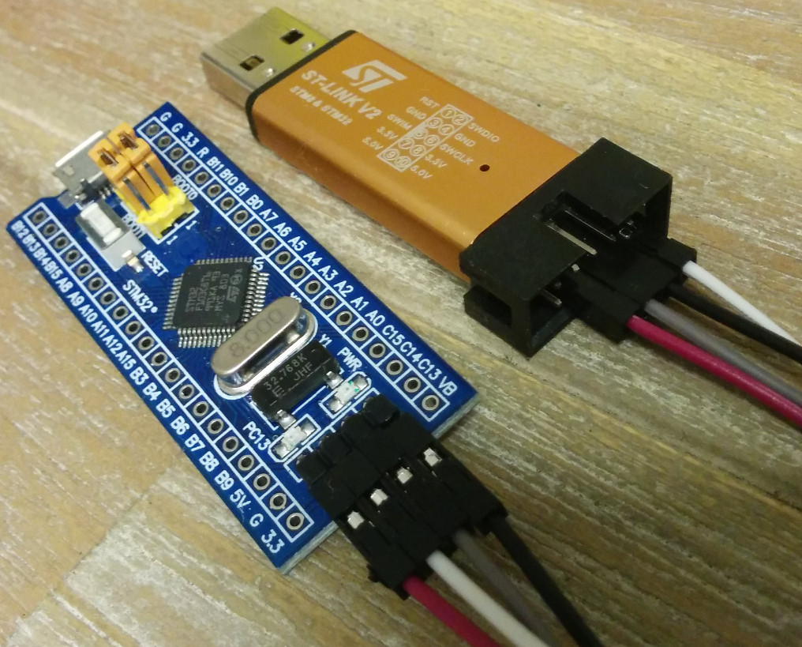

# blue-pill-quickstart [](https://travis-ci.org/TeXitoi/blue-pill-quickstart)

Quickstart a Rust project for the [blue pill](https://wiki.stm32duino.com/index.php?title=Blue_Pill), or any similar STM32F103xx board.

## Quickstart a new project

This section assumes your computer is ready to hack on a blue pill.

Get and cleanup:

```shell
git clone https://github.com/TeXitoi/blue-pill-quickstart.git my-new-project
cd my-new-project
rm -fr .git LICENSE README.md st-link-v2-blue-pill.jpg
git init
```

Edit `Cargo.toml` for author and project name, and you're ready to go.

## Setting up your machine

First, you need hardware. Buy a [blue pill](https://www.aliexpress.com/w/wholesale-stm32f103c8t6.html?&SortType=total_tranpro_desc) and an [ST-Link V2](https://www.aliexpress.com/w/wholesale-st-link-v2.html?SortType=total_tranpro_desc). You also need a computer, the commands below are for a Debian based distribution. It should be easy to adapt the instructions to other operating systems (Linux, MacOSX, Windows).

Install rust and gdb support to compile and debug code for the Cortex-M3 which is the basis of the STM32F103xx MCU:

```shell
curl https://sh.rustup.rs -sSf | sh
rustup target add thumbv7m-none-eabi
sudo apt-get install gdb-arm-none-eabi openocd
```

If your distribution doesn't offer `gdb-arm-none-eabi`, you can try `gdb-multiarch` (on Ubuntu 18.04 for example) or `gdb`. In these cases, you'll have to update `.cargo/config` accordingly.

Clone the repository:

```shell
git clone https://github.com/TeXitoi/blue-pill-quickstart.git
cd blue-pill-quickstart
```

First connect your ST-Link to your blue pill, then connect the ST-Link to your computer.



Launch openocd:

```shell
openocd
```

You should see terminal output like this:

```
Open On-Chip Debugger 0.10.0
[...]
Info : stm32f1x.cpu: hardware has 6 breakpoints, 4 watchpoints
```
 
Open a new terminal, compile and flash

```shell
cd blue-pill-quickstart
cargo run
```

Now, the program is flashed, and you are on a gdb prompt. Type `c` (for continue) you can see the on board LED blinking.

## Trouble Shooting

### Wrong connection of the ST-Link

The pin mapping which is shown on the outer shell of your ST-Link might not be correct. If `openocd` returns `unknown code 0x9`, check the pin mapping by removing the ST-Link's shell, and check if the pin mapping printed on its PCB matches the mapping printed on the outer case.  If they differ, then use the mapping printed on the PCB.

If you're unable to remove the shell or the PCB is not readable, you can try one of these pin mappings which are known to exist:

|pin|      |pin|       | 
|---|------|---|-------|
| 1 | RST  | 2 | SWDIO |
| 3 | GND  | 4 | GND   |
| 5 | SWIM | 6 | SWCLK |
| 7 | 3.3V | 8 | 3.3V  |
| 9 | 5.0V |10 | 5.0V  |

|pin|      |pin|       | 
|---|------|---|-------|
| 1 | RST  | 2 | SWCLK |
| 3 | SWIM | 4 | SWDIO |
| 5 | GND  | 6 | GND   |
| 7 | 3.3V | 8 | 3.3V  |
| 9 | 5.0V |10 | 5.0V  |

### Flash protected

When flashing your blue pill for the first time, flashing may fail with the following messages in the openocd console:

```
Error: stm32x device protected
Error: failed erasing sectors 0 to 23
Error: flash_erase returned -4
```

This means your blue pill's flash is read-only protected. To unlock it, you can connect to your openocd session with:

```shell
telnet localhost 4444
```

... and type the following commands:

```
reset halt
stm32f1x unlock 0
reset halt
```

### MCU in low power state

If the software which was already flashed to the Blue pill has put the processor core into a low power state, then this prevents the hardware debug interface from operating.  In this case, then OpenOCD will create output like this:

```
Error: jtag status contains invalid mode value - communication failure
Polling target stm32f1x.cpu failed, trying to reexamine
Examination failed, GDB will be halted. Polling again in 100ms
Info : Previous state query failed, trying to reconnect
```

To workaround this, press the reset button on the blue pill board whilst starting openocd.  If the software that you've flashed to the STM32F103xx is putting it into the low power mode (e.g. by using the `wfi` instruction), then you might want to disable this (e.g. by busy-looping instead) when building the code in development mode instead of release mode.


## Sources

This quickstart is inspired by the [cortex-m-quickstart](https://github.com/japaric/cortex-m-quickstart) and [Discovery](https://rust-embedded.github.io/discovery/). I recommend reading them.
